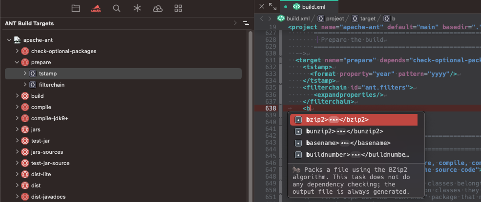

**Ant** provides sidebar integration to use **[Apache Ant](https://ant.apache.org/)** to allow you to launch build targets. It also includes (work-in-progress) completion in XMLs to help edit your XMLs.

Included in the extensions is Apache Ant 1.10.14.

## Requirements

Apache Ant requires some additional tools to be installed on your Mac:

- Java 8 or newer

Make sure that `JAVA_HOME` has been set, and points to a JDK in you system. Otherwise, you may get errors if the build is using `javac`.

## Usage

To display the Ant sidebar:

- Click on the "All Sidebars" button.
- Select **Ant** or drag to a sidebar area

In the Ant sidebar, you can right-click and select "Run" on a target.

On targets and on other elements in the sidebar, you can also select "Show in Build XML" to jump to that point in the XML

## Notes

When word wrapping is enabled, sometimes the `Show in Build XML` does not go to the correct position.

## Configuration

To configure global preferences, open **Extensions → Extension Library...** then select Ant's **Preferences** tab.

You can also configure preferences on a per-project basis in **Project → Project Settings...**

The default it to look for a `build.xml` in the root of your Nova project.

## License

This project bundles [Apache Ant](http://ant.apache.org/), which is licensed under the Apache License 2.0. The full text of the Apache License 2.0 is available in the [apache-ant-1.10.14/LICENSE](apache-ant-1.10.14/LICENSE) file.

'Apache', 'Apache Software Foundation', the multicoloured feather, and the various Apache project names and logos are either registered trademarks or trademarks of The Apache Software Foundation in the United States and other countries.

## Notices

Notices for the Apache Ant project can be found in the [apache-ant-1.10.14/NOTICE](apache-ant-1.10.14/NOTICE) file.