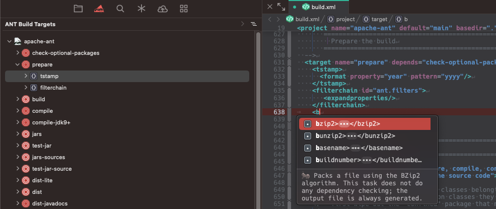

# Ant for Nova

**Ant** for Nova is a Panic Nova extension that integrates **[Apache Ant](https://ant.apache.org/)** directly into the sidebar, allowing you to easily view and run build targets from within your workspace. It also includes (work-in-progress) XML code completions to assist with editing your Ant's `build.xml` files.

This extensions bundles Apache Ant 1.10.15 (released on August 29, 2024).

## 📋 Requirements

Apache Ant requires some additional tools to be installed on your Mac:

- **Java (8 or newer)**

Make sure that `JAVA_HOME` has been set, and points to a JDK in you system. Otherwise, you may get errors if the build is using `javac`.

## 🚀 Usage

To display the Ant sidebar:

- Click on the "All Sidebars" button.
- Select **Ant** or drag to a sidebar area

### Running Targets

- In the Ant sidebar, you can right-click and select "Run" on a target.

- You can also click on the `>` button in the sidebar to run the selected target

### Show in Build XML

- On targets and on other elements in the sidebar, you can also select "Show in Build XML" to jump to that point in the XML

- You can also click on the three-lined button in the side bar to jump to that element in the XML

## ⚙️ Configuration

### Global Settings

To configure global preferences, open **Extensions → Extension Library...** then select Ant's **Preferences** tab.

- **Ant Path**: Here you can optionally specify a custom path for an Ant installation on you system. If left blank, it will use the bundled Apache Ant 1.10.15 will be used.

### Project Settings

You can also configure preferences on a per-project basis in **Project → Project Settings...**

- **Ant Path**: If you only want to use a custom path for an Ant installation on you system for this project.

- **Ant Build File**: Specify a custom Ant build file. The default it to look for a `build.xml` in the root of your Nova project.

## 📄 License

This extension bundles [Apache Ant](http://ant.apache.org/), which is licensed under the [Apache License 2.0](https://www.apache.org/licenses/LICENSE-2.0). The full text of the Apache License 2.0 is available in the [apache-ant-1.10.15/LICENSE](apache-ant-1.10.15/LICENSE) file.

'Apache', 'Apache Software Foundation', the multicolored feather, and the various Apache project names and logos are either registered trademarks or trademarks of The Apache Software Foundation in the United States and other countries.

## 📢 Notices

Notices for the Apache Ant project can be found in the [apache-ant-1.10.15/NOTICE](apache-ant-1.10.15/NOTICE) file.
